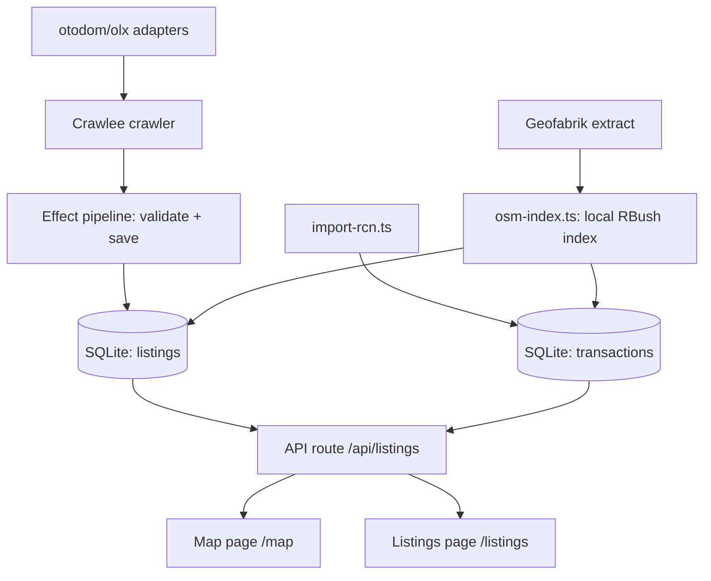

# Flat Tracker — Agent & Contributor Guide

Krakow flat-price tracker: scrapes sale listings from otodom.pl and olx.pl,
joins them with historical transaction prices from Poland's Rejestr Cen
Nieruchomości (RCN), and shows every offer on a map anchored to its
OpenStreetMap building.

## Stack

- **Framework**: TanStack Start (React 19, file-based routing in `src/routes/`)
- **Scraping**: Crawlee 3 + Cheerio (all current adapters parse embedded JSON,
  no browser needed; Playwright crawler path exists for JS-rendered sites)
- **DB**: SQLite + Drizzle ORM (`drizzle-orm/better-sqlite3`)
- **Orchestration**: Effect TS wraps the crawl pipeline (`src/crawler/pipeline.ts`)
- **Geocoding**: Overpass API (free) — building footprints + point-in-polygon
- **Map**: react-leaflet + OpenStreetMap tiles (free)
- **Runtime note**: `better-sqlite3` does NOT work under Bun. All DB-touching
  scripts must run with **Node via tsx** (`npm run ...`), never `bun run ...`.

## Commands

```bash
npm run dev               # start dev server (vite, port 3000)
npm run db:generate       # new migration from schema changes
npm run db:migrate        # apply migrations
npm run crawl -- --site <id> [--save-db]   # crawl one site
npm run crawl:otodom      # otodom Krakow, saves to DB
npm run crawl:olx         # olx Krakow, saves to DB
npm run import-rcn        # import historical RCN transactions (large download)
npm run assign-buildings  # match listings/transactions to OSM buildings
```

`assign-buildings` uses a **local OSM building index** (`osm_buildings`
table) built from a Geofabrik extract of the małopolskie region
(`data/osm/malopolskie.osm.pbf`, ~200 MB, streamed with `osm-pbf-parser`).
Point-in-polygon matching then runs in-memory via RBush — the public
Overpass API is far too rate-limited for the ~84k RCN transactions. The
index is rebuilt automatically when missing; `npm run assign-buildings`
assigns all 84k transactions in minutes, not hours.

## Data sources

| Source | What | Access |
|---|---|---|
| otodom.pl | Active sale listings, Krakow | HTML `__NEXT_DATA__` JSON; list pages have no coords, detail pages (`/pl/oferta/`) add lat/lng |
| olx.pl | Active sale listings, Krakow | HTML `window.__PRERENDERED_STATE__` JSON incl. coordinates |
| RCN (Rejestr Cen Nieruchomości) | Historical notarial transaction prices, Krakow, free since 2026-02-13 | GML zip: `https://rzeczoznawca.eco.um.krakow.pl/RCN/1261_RCN.zip` (~2 GB) |
| OpenStreetMap (Overpass) | Building footprints/addresses | Free API, rate-limited, 3 mirror endpoints |

### RCN GML structure (import-rcn.ts)

Features joined by `gml:id` xlink refs:
`RCN_Transakcja --podstawaPrawna--> RCN_Dokument` (date),
`RCN_Transakcja --nieruchomosc--> RCN_Nieruchomosc` (geometry),
`RCN_Nieruchomosc --lokal--> RCN_Lokal` (area/rooms/floor),
`RCN_Lokal --adresBudynkuZLokalem--> RCN_Adres` (street/number).
We import only `rodzajTransakcji=1` (sales) of `funkcjaLokalu=1` (apartments).
The parser streams with `saxes` — never load the 2 GB file into memory.

Gotchas:

- **CRS is PL-2000 zone 21, not WGS84.** `<gml:pos>` values are easting
  northing in `EPSG:2180` (`+proj=tmerc +lon_0=21 +k=0.999923 +x_0=7500000`).
  `parsePos` converts with `proj4`; sanity bounds are easting
  7_400_000..7_460_000, northing 5_520_000..5_580_000.
- **Geometry lives on `RCN_Dzialka`/`RCN_Budynek`**, not on the
  `RCN_Nieruchomosc` (which only carries xlink refs). The importer resolves
  pos via `nieruchomosc -> dzialka|budynek`.
- Nested elements like `RCN_IdentyfikatorIIP` also start with `RCN_`; the
  parser only starts/ends a feature on matching open/close tags.

## Architecture



### Adding a new site (e.g. Facebook Marketplace, Morizon)

1. Create `src/crawler/sites/<site>.ts` exporting a `CheerioAdapter` (or
   `PlaywrightAdapter`) from `src/crawler/types.ts`.
2. Implement exactly one extraction strategy:
   - **DOM cards**: `listingSelector` + `parseListingCard($, el)`
   - **Embedded JSON**: `extractHtml(html, url, enqueue)` — return listings,
     call `enqueue(urls)` for detail pages / pagination (see `otodom.ts`)
3. Register it in `src/crawler/sites/index.ts`.
4. Test: `npm run crawl -- --site <id> --save-db` (uses Node/tsx).

Normalized `Listing` shape: see `types.ts` (source, externalId, url, title,
price, pricePerM2, areaM2, rooms, floor, district, lat, lng, listedAt).

### DB schema (`src/db/schema.ts`)

- `listings` — active offers; unique `(source, externalId)`; upserted by the
  sink, so detail-page records refine list-page records
- `buildings` — OSM buildings referenced by listings/transactions
  (osmId unique, address, tags, geometry)
- `osm_buildings` — local OSM footprint index for Krakow (bbox, centroid,
  polygon JSON); built from the Geofabrik extract by `osm-index.ts`
- `transactions` — RCN history; unique `transactionId`

## Building assignment

- **Listings** (`assignBuildingsToListings`) — point-in-polygon against the
  local `osm_buildings` index; portal coordinates are approximate so a
  nearest-centroid fallback within 40 m is used.
- **Transactions** — `matchPointStreetAware`: point-in-polygon first (RCN
  points come from `RCN_Lokal.georeferencja` and usually sit inside the
  building), then a 150 m fallback preferring a building whose
  `addr:street` matches the transaction street. This recovers new
  developments whose georeferenced point sits on the plot centroid; all
  84k transactions are assigned (100%).
- The older Overpass path (`geocode.ts`) remains for ad-hoc lookups but is
  not used for bulk assignment (rate-limited: 429s on all mirrors).

## Effect TS usage

`src/crawler/pipeline.ts` models the crawl as an Effect program:

- `CrawlError` (tagged error) — typed failures
- `ListingSchema` — Effect Schema validation of adapter output before saving
- `runCrawl(adapter, saveToDb)` — main program, run via `Effect.runPromise`
- `runCrawlWithRetry(...)` — exponential backoff schedule for cron runs

Keep new pipeline steps in the Effect style: `Effect.tryPromise` with typed
errors, `Schema` for boundary validation, `Schedule` for retries.

## Conventions & gotchas

- Drizzle column names: camelCase unless explicitly named (e.g. `listed_at`).
  In `onConflictDoUpdate`, `excluded.<col>` must match the real column name.
- Overpass rejects generic User-Agents with 406 — `queryOverpass` sends a
  descriptive UA and falls back across 3 mirrors with retries.
- Be polite to free APIs: batching (10 points/request) + 1.2 s delay.
- Crawlee storage: `Configuration({ storageClient: new MemoryStorage() })`
  avoids writing `storage/` dirs to the repo.
- **Map is client-only**: `leaflet` touches `window` at import time and
  crashes SSR. `src/routes/map.tsx` gates the lazy `import()` behind a
  `useEffect` mount flag — never import leaflet in a route module directly.
- The RCN importer skips the download when `RCN_GML_PATH` points at an
  already-extracted file (handy for testing with a partial slice).
- `scripts/` holds throwaway utilities (db-state, overpass-test).

## Roadmap ideas

- Facebook Marketplace adapter (hard anti-bot; may need Patchright/Camoufox)
- Transaction layer on the map (toggle RCN points per district)
- `runCrawlWithRetry` wired into a cron (Nitro `scheduled` or host cron)
- Price history snapshots per listing (table `listing_history`)
- Cache Overpass results to avoid re-querying on every assignment run
