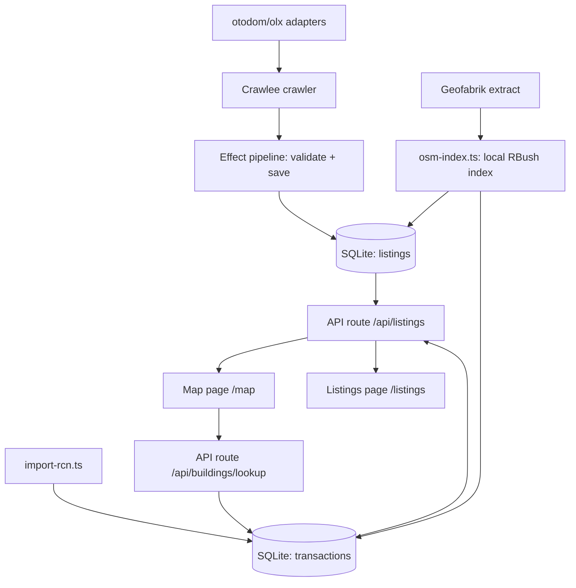

# Flat Tracker — Agent & Contributor Guide

Krakow flat-price tracker: scrapes sale listings from otodom.pl and olx.pl,
joins them with historical transaction prices from Poland's Rejestr Cen
Nieruchomości (RCN), and shows every offer on a map anchored to its
OpenStreetMap building.

## Stack

- **Framework**: TanStack Start (React 19, file-based routing in `src/routes/`)
- **Scraping**: Crawlee 3 + Cheerio (most adapters parse embedded JSON/API
  responses, no browser needed); the WAF-protected sources (booking,
  licytacje-komornik) and the calendar tasks run camoufox through
  `src/crawler/browser.ts` — the only place that launches a browser.
- **DB**: SQLite + Drizzle ORM (`drizzle-orm/better-sqlite3`)
- **Orchestration**: Effect TS wraps the crawl pipeline (`src/crawler/pipeline.ts`)
- **Geocoding**: Overpass API (free) — building footprints + point-in-polygon
- **Map**: mapbox-gl (light-v11 style) with 3D buildings
  (`fill-extrusion` layer), listings as a GeoJSON circle layer, Krakow
  `maxBounds` only. Token: `VITE_MAPBOX_TOKEN` in `.env.local` (public
  `pk.` token — restrict it to the app domain in the Mapbox dashboard).
  Free tier: 50k map loads/month.
- **Runtime note**: `better-sqlite3` crashes under Bun's own runtime
  (verified on Bun 1.4.0), so a TS entry point must never be executed *by*
  bun (`bun src/crawler/...`, `bun file.ts`). Run it through tsx, which the
  package scripts already do (`bun run assign-buildings`).

## Toolchain: bun first

Use **bun** for everything it can do: `bun install` (the lockfile is
`bun.lock`), `bunx <tool>` instead of `npx <tool>`, and `bun run <script>` to
run package scripts — including scripts that open SQLite, because
`bun run assign-buildings` executes `tsx` (Node) rather than the file itself.
The single exception is above: never hand a DB-touching entry point straight
to bun's runtime. `bun run dev` is fine — Vite/Nitro run under Node either way.

Do not write `npx` anywhere (docs, comments, log messages). Where a tool has
to come from the project's own dependency tree, name its bin explicitly, e.g.
`bunx camoufox-js fetch` (the registry package `camoufox` is a different,
unrelated package).

## Commands

```bash
bun install               # dependencies (bun.lock is the lockfile)
bun run dev               # start dev server (vite, port 3000); kicks off a background
                          # data refresh on boot (see `server/plugins/refresh-on-start.ts`)
bun run db:generate       # new migration from schema changes
bun run db:migrate        # apply migrations
bun run assign-buildings  # match listings/transactions to OSM buildings
bun run geocode-addresses # geocode listings that carry only an address
bun run import:rcn-gugik       # małopolska RCN packages (cadence-gated)
bun run import:rcn-gugik:all   # every GUGiK powiat in Poland (resumable drain)
bun run discover:rcn-powiats   # refresh the GUGiK package catalogue
bun run build:powiats     # regenerate src/data/malopolska-powiats.ts (Overpass)
```

### Fresh clone: zero-setup bootstrap

`bun install && bun run dev` must work on a clone with no `.env.local` and no
database:

- `src/db/index.ts` defaults `DATABASE_URL` to `./dev.db` (empty value in
  `.env.local` counts as unset) and creates the parent directory if the path
  has one.
- The same module auto-applies `drizzle/` migrations on first use
  (`src/db/migrate.ts`), so every entry point — dev server, Nitro task, tsx
  scripts — gets a working schema. Re-runs are no-ops via drizzle's
  `__drizzle_migrations` journal. A DB that has tables but no journal (made
  with `db:push`) is skipped with a warning instead of failing mid-migration.
- The dev-start refresh then crawls every portal and fills the DB gradually;
  reference layers (RCN zip, Geofabrik PBF, GUGiK powiat packages) download
  into `data/` on first run.

Keep it that way: nothing user-facing may require an `.env.local` or a manual
migration step to boot.

**`.gitignore` trap:** the crawl-data rules are `/data/` and `/storage/`
(root-anchored). A bare `data/` also matches `src/data/**`, which silently
kept `src/data/malopolska-powiats.ts` out of every clone while
`src/routes/api/powiat-map.ts` imported it — the route tree then failed to
load and *every* page 500'd. Never un-anchor those rules, and keep route-level
imports of optional datasets lazy (`await import()`) so a missing data file
degrades one endpoint instead of the whole app.

### Incremental detail enrichment (otodom)

A `firstPageOnly` run gets one request per source unless the adapter asks for
more (`AdapterBase.firstPageOnlyRequests`). otodom spends 9: the newest list
page plus up to 8 detail pages, and only for offers whose detail was never
parsed (`listings.features` is the marker). Detail pages are the only source
of a flat's coordinates, `build_year`, building material/floors, condition and
market — `db-sink` promotes those out of the `features` JSON into columns — and
otodom's CDN rate-limits bulk detail crawls, hence the small budget. A full
crawl (no `firstPageOnly`) still follows every recent detail page.

### Building age

No official source in this pipeline carries a construction year: the Kraków
RCN GML (`RCN_Budynek` = id, rodzaj, geometria, adres), the GUGiK RCN
GeoPackages (`bud_*` = id, nr, rodzaj, pow_uzyt, cena, adres) and KIEG EGiB
`ms:budynki` (ID_BUDYNKU, RODZAJ, KONDYGNACJE_NADZIEMNE/PODZIEMNE) all lack
one — checked, do not re-investigate. `buildings.build_year` is therefore
derived by `updateBuildingYears()` in `assign-buildings`: the average
`listings.build_year` of the flats anchored to the building, else the OSM
`start_date` tag, else null (never guessed). `/api/buildings/lookup` returns
it and the map popup renders it as "Rok budowy: 1998 · 28 lat".

Browser binaries are a separate download and their absence must stay
non-fatal (reported once per refresh by `src/crawler/browser.ts`). Every
JS-rendered source — booking, licytacje-komornik, and the booking/airbnb
calendar tasks — goes through that one module, which prefers **camoufox**
(`bunx camoufox-js fetch`, ~660 MB, the anti-detect Firefox that also gets
past Booking's DataDome) and falls back to Playwright chromium only if it is
installed (`bunx playwright install chromium`). Camoufox is a Playwright
driver (playwright-core launches its Firefox build), so the library stays;
what is optional is Playwright's *browser download*. `camoufox-js` is a
runtime dependency for that reason. Adapters that need a browser declare
`launchBrowser` (`CustomLaunchAdapter`), which `crawler.ts` calls instead of
letting Crawlee launch chromium. A failed crawl logs a single line (deepest
cause); `CRAWL_DEBUG=1` prints the raw error, and the same line is what
`crawl_runs.error` / `/sources` show.

Crawling is triggered from the UI, not the terminal: the **/sources** page
("Refresh now" → `POST /api/refresh`) runs the same `refreshAll()` as the
hourly task. The old `crawl:*` / `import-rcn` CLI scripts were removed.

`geocode-addresses` fills the coordinate gap for portals that hide
lat/lng (morizon, gratka, domiporta, nieruchomosci-online,
licytacje-komornik): the adapters parse a street address
into `listings.address`, this script matches it against the local
`osm_buildings` index (exact street+housenumber → building centroid,
street-only → street centroid) and falls back to Photon (1 req/s,
validated to Małopolska) for street-level points. Listings
WITHOUT a stored address get one mined from their title (ad speak like
"Łokietka 57B - mieszkanie 30 m²") — the extracted address is persisted.
Re-run `assign-buildings` afterwards to anchor the new points. Komornik
titles are legal notices ("... przy ul. Szkolnej dla której SR dla
Krakowa-Krowodrzy w Krakowie ..."), so geocoding cuts the court
boilerplate ("dla której", "Sąd/SR", "Wydział", "KW nr", "z siedzibą")
before mining a street or city — the court's seat is not the property's
location. For the same reason a city mined from a title only overrides a
generic hint (Kraków/małopolskie/a district); a specific town from the
structured address always wins. The offline town centroid is only used
for unambiguous names: where one village name exists twice in the region
(two "Leśnica"), the centroid map skips it and Photon resolves the name
together with the postal code from the address.

The same pass runs automatically inside every `refreshAll()` with a
Photon budget of 100/run (local index matches are instant), so the
map stays populated between manual drains. Geocoded positions survive
re-crawls: `saveListings` coalesces coordinates, `address` and
`description`, so address-only adapters never overwrite them with NULL
(a plain `excluded.address` here once wiped 28 geocode-mined budujesie
addresses on the next full re-crawl — every nullable column a re-crawl
can re-emit as NULL must be coalesced in `onConflictDoUpdate`). Street-only addresses anchor
to the local street centroid (no building claim); Nominatim results
are cached per street in `data/crawler/nominatim-cache.json` so
duplicate offers and chunked drain runs never re-query. Pass
`--local-only` to the script to skip Nominatim (e.g. while the shared
instance throttles).

## Scheduled (hourly) refresh

Crawls are incremental and idempotent, designed for a once-per-hour cron.
The server itself runs the refresh: a Nitro scheduled task `refresh`
(cron `0 * * * *`, wired in `vite.config.ts` -> `scheduledTasks`,
`experimental.tasks`) executes `refreshAll()` from `src/crawler/refresh.ts`.
It runs in dev AND prod node servers, and the dev server additionally fires
one refresh on startup (`server/plugins/refresh-on-start.ts`, gated on
`import.meta.dev`).

Manual equivalents:

```bash
# /sources page "Refresh now" button → POST /api/refresh (recommended)
curl -X POST http://localhost:3000/_nitro/tasks/refresh   # server task
```

`refreshAll()`: refetches all sources, upserts new/changed listings, prunes
otodom/olx listings older than the since window (default 90 days), then
refreshes RCN transactions (HEAD check; skips when nothing changed) and the
region-wide GUGiK per-powiat GeoPackages — małopolska scope by default
(20 h cadence gate, effectively daily on the hourly cron); set
`RCN_GUGIK_SCOPE=poland` to make the server refresh cover the whole country
instead. When either import inserts new rows, building assignment
(`assign-buildings`) re-runs automatically so new price history shows up
colored on the map.
Portal failures are isolated per site (one blocked portal does not abort
the rest of the run). The task and plugin are registered explicitly in
`vite.config.ts` (no Nitro directory scanning — TanStack Start owns
`src/routes`); the handler path must be an absolute file URL, relative
paths fail to resolve from the virtual tasks module.

**Whole-country loads are a manual drain** (`bun run import:rcn-gugik:all`):
GUGiK publishes one GeoPackage per powiat nationwide (380 packages,
~5.3 GB), so it is not something an hourly server task should pull. The
run is resumable — `data/rcn/gugik/state.json` records the last successful
import per TERYT4, and the cadence gate skips those powiaty on a re-run —
and idempotent, so interrupting it costs only the powiat in flight. The
package catalogue lives in `data/rcn/gugik/teryt-index.json`, discovered
by HEAD-probing the URL space (`bun run discover:rcn-powiats`,
`src/crawler/rcn-gugik-index.ts`); discovery is additive so a flaky probe
can never shrink the catalogue. Kraków (1261) is skipped in both scopes:
`import-rcn.ts` already imports the richer city GML, and a second copy
under `1261-G/...` ids would double-count Kraków in the building price
history. Rows outside małopolska keep their registry coordinates but stay
unbound — the `osm_buildings` index only covers the region.

### Transaction scope: małopolska, explicitly

`transactions` holds the country, but **every screen is regional** —
listings come from małopolska portals, the map is bounded to Kraków, the
powiat choropleth uses małopolska boundaries. So a bare
`FROM transactions` in a route is a bug waiting for the next national
drain: it silently turns a Kraków chart into a national average, and the
choropleth would push ~20M out-of-region rows through point-in-polygon on
every request. Regional queries therefore carry `inMalopolska` from
`src/db/region.ts` (a coordinate box; every małopolska row with geometry
is inside it and nothing else is).

Two consequences worth knowing:

- **`MALOPOLSKA_BBOX_SQL` is shared text, not a helper call**: SQLite only
  matches a partial index when the query predicate and the index predicate
  are structurally identical, and `transactions_malopolska_price_idx`
  (schema.ts) is partial on exactly that string. Reusing it keeps
  `transactions_malopolska_price_idx` in play, which is what makes the
  chart aggregations independent of how much national data is loaded
  (measured 1.07 s → 0.10 s at 3.7M rows). After touching either side,
  check with `explain query plan`.
- Around 10% of małopolska GUGiK rows carry no geometry (no `lat`/`lng`),
  so they drop out of region-scoped aggregates. They could never be
  attributed to a powiat anyway.

`/api/powiat-map` is the slow one (~9 s): it is O(points × powiat
polygons) over ~1M transactions. That is proportional to małopolska data
only, not to national load; the honest fix is a grid/rollup, not a bigger
query.

**Server refreshes fetch only the first, newest-sorted page per site**
(`firstPageOnly: true`, the default in `refreshAll`): each hourly run
captures just the offers that appeared on page 1 and skips pagination and
detail-page follow-ups. `alwaysFullCrawl` opts a source back into full
pagination (investmap: small private investments sit past pages that have
no flats, so skipping page 1 would hide them; licytacje-komornik: the
Małopolska court-auction feed is tiny, so every run re-syncs the whole
list; budujesie: the forum list is sorted by last-post activity, so the
deep pages hold the corpus and every run re-syncs all ~52 topic pages).

**Dev-start runs are diff-only** (`payload: { mode: "dev" }`): each site's
`since` window is `max(now - 7 days, last successful crawl)` — per-site
last-run timestamps live in `data/crawler/state.json` — so a boot only
loads what the portals added since the previous load, and otodom/olx
history is pruned to the 7-day cap. Dev-start runs are also first-page-only.

- Upserts by `(source, externalId)`: re-running is safe and self-refining
  (detail pages add coordinates to list-page records). Each run reports
  the portal diff — how many listings are NEW vs UPDATED.
- Cross-source dedupe in `/api/listings`: rynekpierwotny project rows are
  hidden when the same investment is covered by investmap (exact
  street+housenumber, street-only when the project has no housenumber,
  or normalized investment-title match). Both sources remain selectable
  individually in the UI filters.
- The fetch window is bounded by `sinceDays` (default 90) and older
  otodom/olx listings are pruned afterwards, so the DB only holds
  active/recent offers.
- `importRcn()` starts with a HEAD request on the
  zip; when ETag/Last-Modified match `data/rcn/version.json`, it skips
  the 2 GB download+parse and reports 0 new transactions. When the file
  changed, only rows that are actually NEW are inserted
  (`INSERT OR IGNORE ... RETURNING`), so each run imports exactly the
  diff the registry added.
  Run `bun run assign-buildings` after an RCN refresh to anchor the new
  transactions.
- The crawler paces requests (3 concurrent, ~350 ms delay) and retries
  403s with backoff to stay under portal throttling. Note: Crawlee swaps
  `enqueueLinks` for a no-op stub on non-HTML responses, so JSON-API
  adapters (investmap, komornik) paginate via `addRequests` instead.
- **Blocked portals stop, they never get hammered**: a 429 (or 5 blocked
  403 attempts) ends that source's crawl immediately
  (`blockStatus`/`makeBlockTracker` in `crawler.ts`; `retryOnBlocked: false`,
  `maxRequestRetries: 2`, and `request.noRetry` on the first 429) and the
  source is paused for 2 h via `blocked:<site>` in
  `data/crawler/state.json`. The next `refreshAll()` skips it entirely —
  not one request — and the run summary says "blocked earlier — retry
  after HH:MM". "Try later", never "try again now". A single burst-403
  (otodom/olx) keeps its bounded retries and does not trigger the pause.
- `runCrawlWithRetry` (exponential backoff) backs every site crawl in the
  server refresh task.

`assign-buildings` uses a **local OSM building index** (`osm_buildings`
table) built from a Geofabrik extract of the małopolskie region
(`data/osm/malopolskie.osm.pbf`, ~200 MB, streamed with `osm-pbf-parser`).
The index covers **all of małopolska** (not just Kraków), so region-wide
sources (booking, airbnb: Zakopane, Oświęcim, ...) anchor too.
Point-in-polygon matching then runs in-memory via RBush — the public
Overpass API is far too rate-limited for the ~84k RCN transactions. The
index is rebuilt automatically when missing; `bun run assign-buildings`
assigns all 84k transactions in minutes, not hours.

## Data sources

| Source | What | Access |
|---|---|---|
| otodom.pl | Active sale listings, Małopolska | HTML `__NEXT_DATA__` JSON; list pages have no coords, detail pages (`/pl/oferta/`) add lat/lng, `build_year`, building material/floors, condition, market (`attributes`, promoted by db-sink) |
| otodom.pl (wynajem) | Long-term rental listings, Małopolska | Same `__NEXT_DATA__` path with `/wynajem/mieszkanie/malopolskie`; detail price read from `rentPrice` |
| olx.pl | Active sale listings, Małopolska | HTML `window.__PRERENDERED_STATE__` JSON incl. coordinates |
| morizon.pl / gratka.pl | Same feed (one company), agency-heavy | schema.org LD+JSON (`Offer` nodes); pagination `?page=N` |
| domiporta.pl | Agency listings | LD+JSON `@graph` `ItemList` of `RealEstateListing`; pagination `?PageNumber=N` |
| nieruchomosci-online.pl | Agency listings | LD+JSON `CollectionPage` offers; pagination `&p=N` |
| rynekpierwotny.pl | New-development projects (osiedla) | `window.__INITIAL_STATE__` `offerList.list.offers` with geo points + price ranges; pagination `?page=N` (all pages) |
| investmap.pl | **Every registered Krakow investment with its flats** (incl. small private ones) | Public JSON API `GET /api/investment/search?withEstates=1&categorySlug=mieszkania&citySlug=krakow&offset=N` — flats inline (`es[].list`): area, price, price_m2, floor, rooms; coordinates from the investment |
| licytacje.komornik.pl | Court auction notices (Małopolska real estate, all subcategories) | Playwright only (WAF blocks non-browser TLS); anonymous JSON API `POST /services/item-back/rest/item/search` (same-origin, `termFilters` + `fullTextFilters` city, `offset` pagination); every REAL_ESTATE subcategory kept |
| budujesie.pl | Investments under construction (Kraków housing), one phpBB topic per investment | Plain prosilver DOM cards (`viewforum.php?f=5`, 25 topics/page, `start=N` pagination); rows are long-lived inventory with no price — the map renders them as their own hard-hat symbol layer. The popup label is activity-aware: "Inwestycja w budowie" only while the thread is alive (last post within 18 months), else a factual "ostatnia aktywność MM.YYYY" — the site carries no construction status, so archived topics must not claim to be building. The adapter also fetches each topic's first page (gated per topic by `data/crawler/budujesie-topics.json`, keyed on `lastPostAt`, so only moved threads are re-fetched): the OP text becomes `description` and the preferred address source (post prose beats title mining and resolves the town — "powstaje przy ul. X w Wieliczce"), and up to 8 posts go into `features.posts`, rendered as the description + comments under the investment in the map popup and the listings expanded row. phpBB date quirks and the thread/OP-address parsing are pinned by `scripts/validate-budujesie.ts` |
| RCN (Rejestr Cen Nieruchomości) | Historical notarial transaction prices, Krakow, free since 2026-02-13 | GML zip: `https://rzeczoznawca.eco.um.krakow.pl/RCN/1261_RCN.zip` (~2 GB) |
| GUGiK RCN (Usługa Transakcje) | Same, but every powiat in Poland: małopolska by default, the other ~358 on demand (per-powiat GeoPackages; parcel/building/lokal transactions) | `https://opendata.geoportal.gov.pl/InneDane/latest_exports/rcn_transakcje_ceny/GPKG/{teryt}_transakcje_ceny.gpkg.zip` — imported by `import-rcn-gugik.ts` (`bun run import:rcn-gugik`, `bun run import:rcn-gugik:all`) |
| OpenStreetMap (Overpass) | Building footprints/addresses | Free API, rate-limited, 3 mirror endpoints |

### RCN GML structure (import-rcn.ts)

Features joined by `gml:id` xlink refs:
`RCN_Transakcja --podstawaPrawna--> RCN_Dokument` (date),
`RCN_Transakcja --nieruchomosc--> RCN_Nieruchomosc` (geometry),
`RCN_Nieruchomosc --lokal--> RCN_Lokal` (area/rooms/floor),
`RCN_Lokal --adresBudynkuZLokalem--> RCN_Adres` (street/number).
We import only `rodzajTransakcji=1` (sales) of `funkcjaLokalu=1` (apartments).
The parser streams with `saxes` — never load the 2 GB file into memory.

Gotchas:

- **CRS is PL-2000 zone 21, not WGS84.** `<gml:pos>` values are easting
  northing in `EPSG:2180` (`+proj=tmerc +lon_0=21 +k=0.999923 +x_0=7500000`).
  `parsePos` converts with `proj4`; sanity bounds are easting
  7_400_000..7_460_000, northing 5_520_000..5_580_000.
- **Dates can be registry typos**: GUGiK ships a handful of rows with
  impossible `dok_data` (year 9202, year 14 — 104 future-dated and 509
  pre-1990 rows in 4.77M). They are imported as-is (the table mirrors the
  registry), and every chart filters by date range so they never show up;
  the building price history does not filter, so a single bogus date there
  is cosmetic, not broken.
- **Geometry lives on `RCN_Dzialka`/`RCN_Budynek`**, not on the
  `RCN_Nieruchomosc` (which only carries xlink refs). The importer resolves
  pos via `nieruchomosc -> dzialka|budynek`.
- Nested elements like `RCN_IdentyfikatorIIP` also start with `RCN_`; the
  parser only starts/ends a feature on matching open/close tags.

## Architecture



Clicking a 3D building on the map queries `/api/buildings/lookup?lat&lng`
(point-in-polygon over the `buildings` table, 30 m nearest-centroid
fallback) and shows the building's RCN price history: transaction count,
average/range zł/m², year-by-year breakdown and the 5 most recent sales.
This is the same RCN data that portals like deweloperuch.pl aggregate —
imported locally by the refresh pipeline (`import-rcn.ts`), no extra
scraping needed.

### Adding a new site (e.g. Facebook Marketplace, Morizon)

1. Create `src/crawler/sites/<site>.ts` exporting a `CheerioAdapter` (or
   `PlaywrightAdapter`) from `src/crawler/types.ts`.
2. Implement exactly one extraction strategy:
   - **DOM cards**: `listingSelector` + `parseListingCard($, el)`
   - **Embedded JSON**: `extractHtml(html, url, enqueue)` — return listings,
     call `enqueue(urls)` for detail pages / pagination (see `otodom.ts`)
   - **LD+JSON**: many Polish portals (morizon, gratka, domiporta,
     nieruchomosci-online) embed their feed as schema.org JSON. Use
     `parseLdJson`/`findLdNodes` from `ldjson.ts`, or the
     `makeLdOfferAdapter` factory for the shared Morizon/Gratka shape.
3. Register it in `src/crawler/sites/index.ts`, and add a descriptor to
   `src/crawler/source-status.ts`. The **/sources** page and
   `/api/crawl-status` read that STATIC literal (it must not import
   `sites/index.ts` — see its header comment), so a source registered only
   in the adapter graph gets crawled but stays invisible on the status page.
4. Test: trigger a refresh from the **/sources** page (or POST
   `/_nitro/tasks/refresh`) and watch the new site's row on the status page.

Normalized `Listing` shape: see `types.ts` (source, externalId, url, title,
price, pricePerM2, areaM2, rooms, floor, district, lat, lng, listedAt).

### DB schema (`src/db/schema.ts`)

- `listings` — active offers; unique `(source, externalId)`; upserted by the
  sink, so detail-page records refine list-page records
- `buildings` — OSM buildings referenced by listings/transactions
  (osmId unique, address, tags, geometry)
- `osm_buildings` — local OSM footprint index for małopolska (bbox, centroid,
  polygon JSON); built from the Geofabrik extract by `osm-index.ts`
- `transactions` — RCN history; unique `transactionId`

## Building assignment

- **Listings** (`assignBuildingsToListings`) — point-in-polygon against the
  local `osm_buildings` index; portal coordinates are approximate so a
  nearest-centroid fallback within 40 m is used.
- **Transactions** — **address-first** (`matchByAddress` in
  `address-index.ts`): RCN transactions carry street + housenumber from
  notarial records, matched exactly against OSM `addr:street` +
  `addr:housenumber`, gated by the transaction's own coordinates (same
  street + number can exist in several towns, so matches farther than
  300 m from the record's point are rejected). Without an
  address match, fall back to `matchPointStreetAware`: point-in-polygon,
  then a 150 m street-aware fallback. Re-running the script corrects any
  geo-fallback assignments that disagree with the address.
- The older Overpass path (`geocode.ts`) remains for ad-hoc lookups but is
  not used for bulk assignment (rate-limited: 429s on all mirrors).

## Effect TS usage

`src/crawler/pipeline.ts` models the crawl as an Effect program:

- `CrawlError` (tagged error) — typed failures
- `ListingSchema` — Effect Schema validation of adapter output before saving
- `runCrawl(adapter, saveToDb)` — main program, run via `Effect.runPromise`
- `runCrawlWithRetry(...)` — exponential backoff schedule for cron runs

Keep new pipeline steps in the Effect style: `Effect.tryPromise` with typed
errors, `Schema` for boundary validation, `Schedule` for retries.

## Conventions & gotchas

- Drizzle column names: camelCase unless explicitly named (e.g. `listed_at`).
  In `onConflictDoUpdate`, `excluded.<col>` must match the real column name.
- Overpass rejects generic User-Agents with 406 — `queryOverpass` sends a
  descriptive UA and falls back across 3 mirrors with retries.
- Be polite to free APIs: batching (10 points/request) + 1.2 s delay.
- Crawlee storage: `Configuration({ storageClient: new MemoryStorage({
  persistStorage: false }) })` — truly in-memory, never writes `storage/`
  dirs, and concurrent crawls (dev server + hourly task) can't race over
  queue files on disk.
- **Map is client-only**: `mapbox-gl` touches `window` at import time and
  crashes SSR. `src/routes/map.tsx` gates the lazy `import()` behind a
  `useEffect` mount flag — never import mapbox-gl in a route module
  directly. `map-view.tsx` keeps the map instance in a ref; a second
  effect pushes `setData` into the GeoJSON source when the source filter
  changes.
- The RCN importer skips the download when `RCN_GML_PATH` points at an
  already-extracted file (handy for testing with a partial slice).
- `src/data/malopolska-powiats.ts` is generated (`bun run build:powiats`,
  cached Overpass response in `data/powiats/`): one closed ring per entry,
  outer boundaries first then holes, matched with an **even-odd** rule so
  Tarnów/Nowy Sącz are not double-counted into the powiat around them.
  Rings are simplified to ~90 m — enough for point-in-polygon bucketing.
- DB access goes through `#/db/index` only. It migrates on import, so a new
  script never needs a manual `db:migrate`; don't open `better-sqlite3`
  directly (except throwaway tools in `scripts/`).
- `scripts/` holds throwaway utilities (db-state, overpass-test).
- Schema gaps that are known and intentional: `todos` is an unused template
  table (no code reads it), and nothing ever sets `listings.is_active = 0`
  (the sink always writes 1) — "active" means "still in the DB", removal
  happens through pruning, not through a sold/withdrawn state.

## Roadmap ideas

- Facebook Marketplace adapter (hard anti-bot; may need Patchright/Camoufox)
- Transaction layer on the map (toggle RCN points per district)
- Price history snapshots per listing (table `listing_history`)
- Cache Overpass results to avoid re-querying on every assignment run
