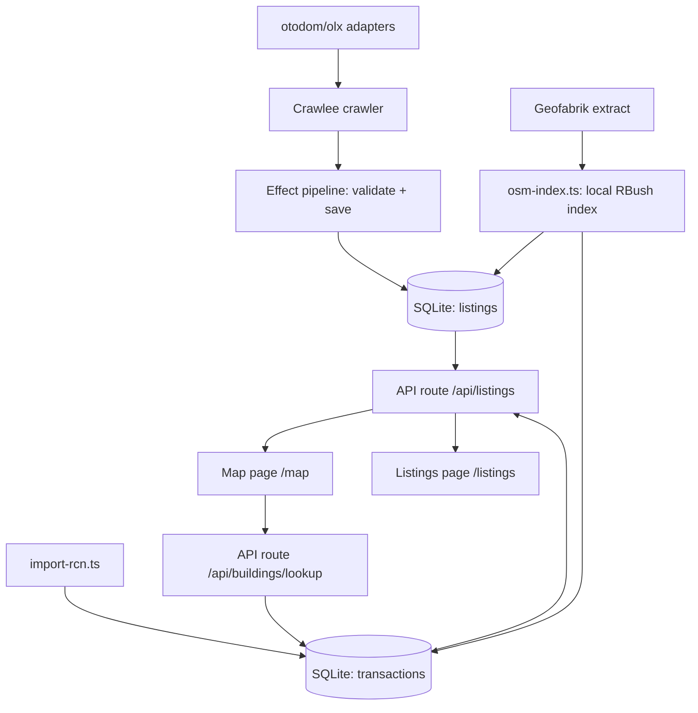

# Flat Tracker — Agent & Contributor Guide

Krakow flat-price tracker: scrapes sale listings from otodom.pl and olx.pl,
joins them with historical transaction prices from Poland's Rejestr Cen
Nieruchomości (RCN), and shows every offer on a map anchored to its
OpenStreetMap building.

## Stack

- **Framework**: TanStack Start (React 19, file-based routing in `src/routes/`)
- **Scraping**: Crawlee 3 + Cheerio (all current adapters parse embedded JSON,
  no browser needed; Playwright crawler path exists for JS-rendered sites)
- **DB**: SQLite + Drizzle ORM (`drizzle-orm/better-sqlite3`)
- **Orchestration**: Effect TS wraps the crawl pipeline (`src/crawler/pipeline.ts`)
- **Geocoding**: Overpass API (free) — building footprints + point-in-polygon
- **Map**: mapbox-gl (light-v11 style) with 3D buildings
  (`fill-extrusion` layer), listings as a GeoJSON circle layer, Krakow
  `maxBounds` only. Token: `VITE_MAPBOX_TOKEN` in `.env.local` (public
  `pk.` token — restrict it to the app domain in the Mapbox dashboard).
  Free tier: 50k map loads/month.
- **Runtime note**: `better-sqlite3` does NOT work under Bun. All DB-touching
  scripts must run with **Node via tsx** (`npm run ...`), never `bun run ...`.

## Commands

```bash
npm run dev               # start dev server (vite, port 3000); kicks off a background
                          # data refresh on boot (see `server/plugins/refresh-on-start.ts`)
npm run db:generate       # new migration from schema changes
npm run db:migrate        # apply migrations
npm run crawl -- --site <id> [--save-db] [--since-days N]   # crawl one site
npm run crawl:otodom      # otodom Krakow, saves to DB
npm run crawl:olx         # olx Krakow, saves to DB
npm run crawl:all         # all 10 sites + incremental RCN diff (same program as the server refresh task)
npm run crawl:komornik    # licytacje.komornik.pl (Krakow flats+plots), saves to DB
npm run crawl:skaleczna   # skaleczna.pl (Koneser Group, Kazimierz), saves to DB
npm run crawl:investmap   # investmap.pl — every Krakow investment + flats (auto-discovery of private developments)
npm run import-rcn        # RCN transactions: HEADs the zip, imports only NEW rows (diff)
npm run import-rcn:force  # re-download + re-import everything
npm run assign-buildings  # match listings/transactions to OSM buildings
npm run geocode-addresses # geocode listings that carry only an address
```

`geocode-addresses` fills the coordinate gap for portals that hide
lat/lng (morizon, gratka, domiporta, nieruchomosci-online,
licytacje-komornik): the adapters parse a street address into
`listings.address`, then this script matches it against the local
`osm_buildings` index (exact street+housenumber → building centroid,
street-only → street centroid) and falls back to Nominatim (1 req/s,
descriptive UA) for street-level points. Re-run `assign-buildings`
afterwards to anchor the new points.

## Scheduled (hourly) refresh

Crawls are incremental and idempotent, designed for a once-per-hour cron.
The server itself runs the refresh: a Nitro scheduled task `refresh`
(cron `0 * * * *`, wired in `vite.config.ts` -> `scheduledTasks`,
`experimental.tasks`) executes `refreshAll()` from `src/crawler/refresh.ts`
— the same program as `npm run crawl:all`. It runs in dev AND prod node
servers, and the dev server additionally fires one refresh on startup
(`server/plugins/refresh-on-start.ts`, gated on `import.meta.dev`).

Manual equivalents:

```bash
npm run crawl:all           # CLI: all 7 sites + incremental RCN diff
curl -X POST http://localhost:3000/_nitro/tasks/refresh   # server task
```

`refreshAll()`: refetches all sources, upserts new/changed listings, prunes
otodom/olx listings older than the since window (default 90 days), then
refreshes RCN transactions (HEAD check; skips when nothing changed).
Portal failures are isolated per site (one blocked portal does not abort
the rest of the run). The task and plugin are registered explicitly in
`vite.config.ts` (no Nitro directory scanning — TanStack Start owns
`src/routes`); the handler path must be an absolute file URL, relative
paths fail to resolve from the virtual tasks module.

**Dev-start runs are diff-only** (`payload: { mode: "dev" }`): each site's
`since` window is `max(now - 7 days, last successful crawl)` — per-site
last-run timestamps live in `data/crawler/state.json` — so a boot only
loads what the portals added since the previous load, and otodom/olx
history is pruned to the 7-day cap. The hourly cron keeps the full
90-day window.

- Upserts by `(source, externalId)`: re-running is safe and self-refining
  (detail pages add coordinates to list-page records). Each run reports
  the portal diff — how many listings are NEW vs UPDATED.
- Cross-source dedupe in `/api/listings`: rynekpierwotny project rows are
  hidden when the same investment is covered by investmap (exact
  street+housenumber, street-only when the project has no housenumber,
  or normalized investment-title match). Both sources remain selectable
  individually in the UI filters.
- `--since-days N` bounds the fetch window and prunes older portal
  listings afterwards, so the DB only holds active/recent offers.
- `import-rcn` (part of `crawl:all`) starts with a HEAD request on the
  zip; when ETag/Last-Modified match `data/rcn/version.json`, it skips
  the 2 GB download+parse and reports 0 new transactions. When the file
  changed, only rows that are actually NEW are inserted
  (`INSERT OR IGNORE ... RETURNING`), so each run imports exactly the
  diff the registry added. `--force` re-downloads and re-imports.
  Run `npm run assign-buildings` after an RCN refresh to anchor the new
  transactions.
- The crawler paces requests (3 concurrent, ~350 ms delay) and retries
  403s with backoff to stay under portal throttling. Note: Crawlee swaps
  `enqueueLinks` for a no-op stub on non-HTML responses, so JSON-API
  adapters (investmap, komornik) paginate via `addRequests` instead.
- `runCrawlWithRetry` (exponential backoff) backs every site crawl in the
  server refresh task and the `--retry` CLI flag.

`assign-buildings` uses a **local OSM building index** (`osm_buildings`
table) built from a Geofabrik extract of the małopolskie region
(`data/osm/malopolskie.osm.pbf`, ~200 MB, streamed with `osm-pbf-parser`).
Point-in-polygon matching then runs in-memory via RBush — the public
Overpass API is far too rate-limited for the ~84k RCN transactions. The
index is rebuilt automatically when missing; `npm run assign-buildings`
assigns all 84k transactions in minutes, not hours.

## Data sources

| Source | What | Access |
|---|---|---|
| otodom.pl | Active sale listings, Krakow | HTML `__NEXT_DATA__` JSON; list pages have no coords, detail pages (`/pl/oferta/`) add lat/lng |
| olx.pl | Active sale listings, Krakow | HTML `window.__PRERENDERED_STATE__` JSON incl. coordinates |
| morizon.pl / gratka.pl | Same feed (one company), agency-heavy | schema.org LD+JSON (`Offer` nodes); pagination `?page=N` |
| domiporta.pl | Agency listings | LD+JSON `@graph` `ItemList` of `RealEstateListing`; pagination `?PageNumber=N` |
| nieruchomosci-online.pl | Agency listings | LD+JSON `CollectionPage` offers; pagination `&p=N` |
| rynekpierwotny.pl | New-development projects (osiedla) | `window.__INITIAL_STATE__` `offerList.list.offers` with geo points + price ranges; pagination `?page=N` (all pages) |
| investmap.pl | **Every registered Krakow investment with its flats** (incl. small private ones) | Public JSON API `GET /api/investment/search?withEstates=1&categorySlug=mieszkania&citySlug=krakow&offset=N` — flats inline (`es[].list`): area, price, price_m2, floor, rooms; coordinates from the investment |
| skaleczna.pl | Koneser Group private investment (Skałeczna 1/3/5/7, Kazimierz) | WordPress table `#offer-table` — unit rows with area, promo/regular price, status; only `Wolne` kept |
| licytacje.komornik.pl | Court auction notices (Krakow flats+plots) | Playwright only (WAF blocks non-browser TLS); anonymous JSON API `POST /services/item-back/rest/item/search` (same-origin, `termFilters` + `fullTextFilters` city, `offset` pagination); subcategories APARTMENTS/LAND |
| RCN (Rejestr Cen Nieruchomości) | Historical notarial transaction prices, Krakow, free since 2026-02-13 | GML zip: `https://rzeczoznawca.eco.um.krakow.pl/RCN/1261_RCN.zip` (~2 GB) |
| OpenStreetMap (Overpass) | Building footprints/addresses | Free API, rate-limited, 3 mirror endpoints |

### RCN GML structure (import-rcn.ts)

Features joined by `gml:id` xlink refs:
`RCN_Transakcja --podstawaPrawna--> RCN_Dokument` (date),
`RCN_Transakcja --nieruchomosc--> RCN_Nieruchomosc` (geometry),
`RCN_Nieruchomosc --lokal--> RCN_Lokal` (area/rooms/floor),
`RCN_Lokal --adresBudynkuZLokalem--> RCN_Adres` (street/number).
We import only `rodzajTransakcji=1` (sales) of `funkcjaLokalu=1` (apartments).
The parser streams with `saxes` — never load the 2 GB file into memory.

Gotchas:

- **CRS is PL-2000 zone 21, not WGS84.** `<gml:pos>` values are easting
  northing in `EPSG:2180` (`+proj=tmerc +lon_0=21 +k=0.999923 +x_0=7500000`).
  `parsePos` converts with `proj4`; sanity bounds are easting
  7_400_000..7_460_000, northing 5_520_000..5_580_000.
- **Geometry lives on `RCN_Dzialka`/`RCN_Budynek`**, not on the
  `RCN_Nieruchomosc` (which only carries xlink refs). The importer resolves
  pos via `nieruchomosc -> dzialka|budynek`.
- Nested elements like `RCN_IdentyfikatorIIP` also start with `RCN_`; the
  parser only starts/ends a feature on matching open/close tags.

## Architecture



Clicking a 3D building on the map queries `/api/buildings/lookup?lat&lng`
(point-in-polygon over the `buildings` table, 30 m nearest-centroid
fallback) and shows the building's RCN price history: transaction count,
average/range zł/m², year-by-year breakdown and the 5 most recent sales.
This is the same RCN data that portals like deweloperuch.pl aggregate —
imported locally by `npm run import-rcn`, no extra scraping needed.

### Adding a new site (e.g. Facebook Marketplace, Morizon)

1. Create `src/crawler/sites/<site>.ts` exporting a `CheerioAdapter` (or
   `PlaywrightAdapter`) from `src/crawler/types.ts`.
2. Implement exactly one extraction strategy:
   - **DOM cards**: `listingSelector` + `parseListingCard($, el)`
   - **Embedded JSON**: `extractHtml(html, url, enqueue)` — return listings,
     call `enqueue(urls)` for detail pages / pagination (see `otodom.ts`)
   - **LD+JSON**: many Polish portals (morizon, gratka, domiporta,
     nieruchomosci-online) embed their feed as schema.org JSON. Use
     `parseLdJson`/`findLdNodes` from `ldjson.ts`, or the
     `makeLdOfferAdapter` factory for the shared Morizon/Gratka shape.
3. Register it in `src/crawler/sites/index.ts`.
4. Test: `npm run crawl -- --site <id> --save-db` (uses Node/tsx).

Normalized `Listing` shape: see `types.ts` (source, externalId, url, title,
price, pricePerM2, areaM2, rooms, floor, district, lat, lng, listedAt).

### DB schema (`src/db/schema.ts`)

- `listings` — active offers; unique `(source, externalId)`; upserted by the
  sink, so detail-page records refine list-page records
- `buildings` — OSM buildings referenced by listings/transactions
  (osmId unique, address, tags, geometry)
- `osm_buildings` — local OSM footprint index for Krakow (bbox, centroid,
  polygon JSON); built from the Geofabrik extract by `osm-index.ts`
- `transactions` — RCN history; unique `transactionId`

## Building assignment

- **Listings** (`assignBuildingsToListings`) — point-in-polygon against the
  local `osm_buildings` index; portal coordinates are approximate so a
  nearest-centroid fallback within 40 m is used.
- **Transactions** — **address-first** (`matchByAddress` in
  `address-index.ts`): RCN transactions carry street + housenumber from
  notarial records, matched exactly against OSM `addr:street` +
  `addr:housenumber`. ~54k of 84k transactions have an address match
  (verified: zero mismatches against assigned buildings). Without an
  address match, fall back to `matchPointStreetAware`: point-in-polygon,
  then a 150 m street-aware fallback. Re-running the script corrects any
  geo-fallback assignments that disagree with the address.
- The older Overpass path (`geocode.ts`) remains for ad-hoc lookups but is
  not used for bulk assignment (rate-limited: 429s on all mirrors).

## Effect TS usage

`src/crawler/pipeline.ts` models the crawl as an Effect program:

- `CrawlError` (tagged error) — typed failures
- `ListingSchema` — Effect Schema validation of adapter output before saving
- `runCrawl(adapter, saveToDb)` — main program, run via `Effect.runPromise`
- `runCrawlWithRetry(...)` — exponential backoff schedule for cron runs

Keep new pipeline steps in the Effect style: `Effect.tryPromise` with typed
errors, `Schema` for boundary validation, `Schedule` for retries.

## Conventions & gotchas

- Drizzle column names: camelCase unless explicitly named (e.g. `listed_at`).
  In `onConflictDoUpdate`, `excluded.<col>` must match the real column name.
- Overpass rejects generic User-Agents with 406 — `queryOverpass` sends a
  descriptive UA and falls back across 3 mirrors with retries.
- Be polite to free APIs: batching (10 points/request) + 1.2 s delay.
- Crawlee storage: `Configuration({ storageClient: new MemoryStorage({
  persistStorage: false }) })` — truly in-memory, never writes `storage/`
  dirs, and concurrent crawls (dev server + hourly task) can't race over
  queue files on disk.
- **Map is client-only**: `mapbox-gl` touches `window` at import time and
  crashes SSR. `src/routes/map.tsx` gates the lazy `import()` behind a
  `useEffect` mount flag — never import mapbox-gl in a route module
  directly. `map-view.tsx` keeps the map instance in a ref; a second
  effect pushes `setData` into the GeoJSON source when the source filter
  changes.
- The RCN importer skips the download when `RCN_GML_PATH` points at an
  already-extracted file (handy for testing with a partial slice).
- `scripts/` holds throwaway utilities (db-state, overpass-test).

## Roadmap ideas

- Facebook Marketplace adapter (hard anti-bot; may need Patchright/Camoufox)
- Transaction layer on the map (toggle RCN points per district)
- Price history snapshots per listing (table `listing_history`)
- Cache Overpass results to avoid re-querying on every assignment run
